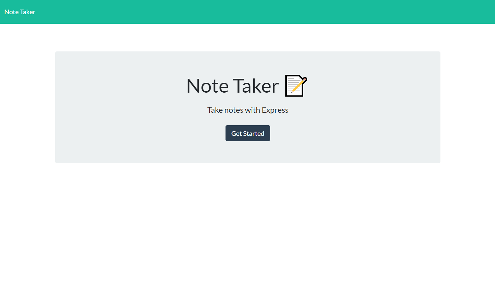
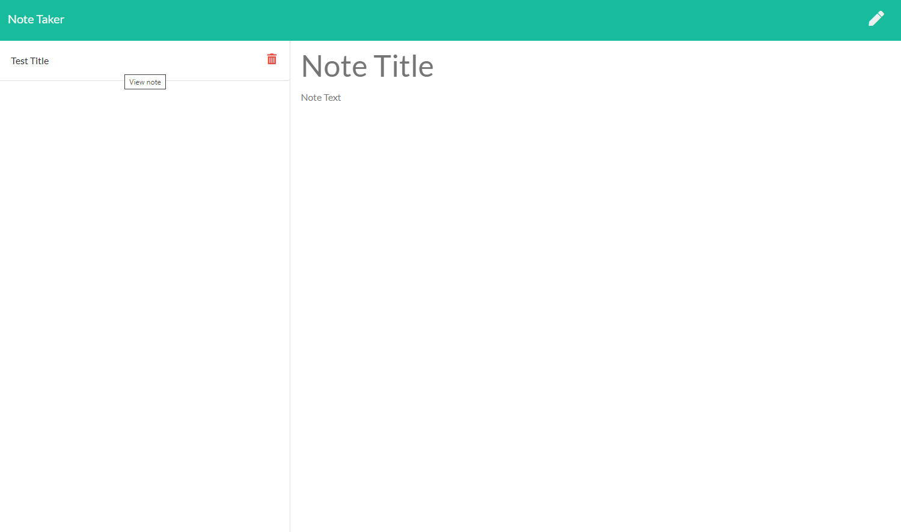

# HW-11-Express-Note-Taker

## Description
 
This web application lets the user keep, preview and delete notes that may help to organize their day.  
 
## Table of Contents 
  
* [Usage](#Usage) 
* [License](#License) 
* [Contributing](#Contributing) 
* [Tests](#Tests) 
* [Questions](#Questions)
 
 
## Usage 
 
Follow the link below.
Click on the `Get Started` button to begin taking notes. Fill in the fields for a title and contents of the note. A `Save Icon` will appear in the upper right. Saved notes will appear on the left which can be deleted or reviewed. The `Pencil Icon` will let you create a new note.

[Link](https://drewbcnotetaker.herokuapp.com/)

 
## License 
 

 
## Contributing 
 
none
 
## Tests 
 
None
 
## Questions 
 
[Github Profile](https://github.com/DrewAlvarez/) 
 
I can be contacted at this email: <alvarez.drew@gmail.com>